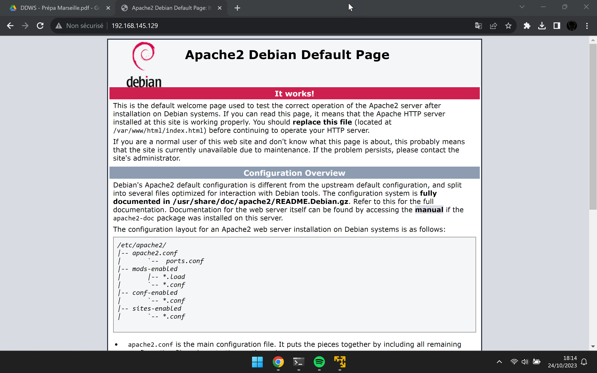
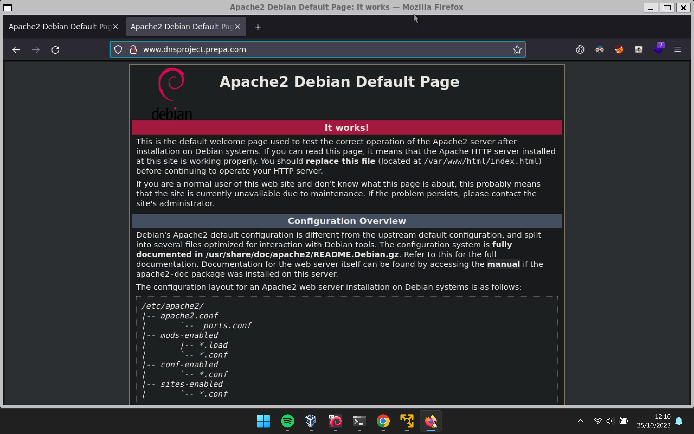

# DDWS
Serveur réseau

## Job 01
Je ne pense pas qu'il soit encore nécessaire de préciser comment
on intalle une machine virtuelle sur à l'aide de VirtualBox, VMware ou un
autre hyperviseur.

Configuration de la machine virtuelle:
- Mémoire: 4 GB
- Processeur: 2
- Disque: 20GB

A la fin de l'installation on verifie que le serveur ssh est opérationnel:
```bash
systemctl status ssh
● ssh.service - OpenBSD Secure Shell server
     Loaded: loaded (/lib/systemd/system/ssh.service; enabled; preset: enabled)
     Active: active (running) since Tue 2023-10-24 17:34:23 CEST; 1min 49s ago
       Docs: man:sshd(8)
             man:sshd_config(5)
    Process: 713 ExecStartPre=/usr/sbin/sshd -t (code=exited, status=0/SUCCESS)
   Main PID: 754 (sshd)
      Tasks: 1 (limit: 4582)
     Memory: 3.4M
        CPU: 50ms
     CGroup: /system.slice/ssh.service
             └─754 "sshd: /usr/sbin/sshd -D [listener] 0 of 10-100 startups"

Warning: some journal files were not opened due to insufficient permissions.
```

Pour la suite du sujet nous ferons l'intégralité de l'installation dans un terminal
au travers de la connexion SSH. Selon le contexte et même si cela n'est pas précisé
dans la documentation, nous pourrons effectuer nos différentes actions avec des élévations
de droits sans le préciser explicitement.

## Job 02
Installation d'un serveur Apache2

```bash
sudo apt install apache2 -y &&
systemcl status apache2
● apache2.service - The Apache HTTP Server
     Loaded: loaded (/lib/systemd/system/apache2.service; enabled; preset: enabled)
     Active: active (running) since Tue 2023-10-24 17:53:15 CEST; 25s ago
       Docs: https://httpd.apache.org/docs/2.4/
   Main PID: 3335 (apache2)
      Tasks: 55 (limit: 4582)
     Memory: 10.7M
        CPU: 104ms
     CGroup: /system.slice/apache2.service
             ├─3335 /usr/sbin/apache2 -k start
             ├─3337 /usr/sbin/apache2 -k start
             └─3338 /usr/sbin/apache2 -k start
```


## Job 03
Les différents types de serveurs web:
- Apache2: l'un des serveurs les plus populaires et des plus utilisés sur internet. Il est utilisable sur n'importe
quel système d'exploitation et dispose d'énormément de plugins. Produit depuis 1995, son code est éprouvé et les
failles de sécurités sont très rapidement corrigés grâce à une équipe de développement très active.
- NGINX: un petit nouveau par rapport aux autre (2004). C'est un reverse-proxy natif et support des charges très importantes.
Néanmoins, sans rentrer dans des détails politiques, et aux vues du contexte actuel, je me méfie d'un projet créé et
gérée par une forte communauté russe. 
- IIS: serveur web fonctionnent uniquement sous Windows Server. Il permet de gérer une application Web avec une prise
en charge avancée des langages de programmation au travers des modules CGI. Il s'administre facilement via le gestionnaire
de serveur. Date de première sortie 1995.

Il en existe encore un bon nombre écrits dans différents langages et sous différentes licences. Je pense que je
vais m'arrêter là.

## Job 04
Mise en place d'un serveur DNS:
domaine principal dnsproject.prepa.com

- Installation des paquets
```bash
sudo apt install -y bind9 bind9utils bind9-docs dnsutils
```

- Editiondu fichier /etc/bind/named.conf.options:
```bind
options {
    directory "/var/cache/bind"
    version "Bind Server";

    forward {
        8.8.8.8;
        1.1.1.1;
    };

    listen-on port 53 {localhost; 192.168.145.0;};
    dnssec-validation auto;
    allow-recursion { 127.0.0.1; };
    auth-nxdomain no;
    listen-on-v6 { any;};
};
```

- Edition du fichier /etc/bind/named.conf.local:
```bind
zone "dnsproject.prepa.com" {
    type master;
    file "/etc/bind/db.dnsproject.prepa.com";
    notify yes;
    allow-update { none; };
    allow-transfer { 192.168.145.129; };
    also-notify { 192.168.145.129; };
};
```

- Création du fichier de zone /etc/bind/db.dnsproject.prepa.com
```bind
$TTL 86400
@   IN  SOA ns.dnsproject.prepa.com. admin.dnsproject.prepa.com. (
            202310251   ;   serial
            3600        ;   refresh
            1800        ;   retry
            604800      ;   expire
            86400 )     ;   minimum

            IN  NS  ns.dnsproject.prepa.com.    ;

@           IN  A   192.168.145.129
ns          IN  A   192.168.145.129
www         IN  A   192.168.145.129
```

- On verifie enfin que le service est bien configuré:
```bash
named-checkconf /etc/bind/named.conf
named-checkzone /etc/bind/db.dnsproject.prepa.com
```

- On lance enfin le service et on vérifie la résolution:
```bash
sudo systemctl enable --now bind9 &&
systemctl status bind9
● named.service - BIND Domain Name Server
     Loaded: loaded (/lib/systemd/system/named.service; enabled; preset: enabled)
     Active: active (running) since Wed 2023-10-25 00:40:20 CEST; 52min ago
       Docs: man:named(8)
   Main PID: 9308 (named)
     Status: "running"
      Tasks: 6 (limit: 4582)
     Memory: 40.0M
        CPU: 131ms
     CGroup: /system.slice/named.service
             └─9308 /usr/sbin/named -f -u bind

dig www.dnsproject.prepa.com

; <<>> DiG 9.18.19-1~deb12u1-Debian <<>> www.dnsproject.prepa.com
;; global options: +cmd
;; Got answer:
;; ->>HEADER<<- opcode: QUERY, status: NOERROR, id: 61173
;; flags: qr aa rd ra; QUERY: 1, ANSWER: 1, AUTHORITY: 0, ADDITIONAL: 1

;; OPT PSEUDOSECTION:
; EDNS: version: 0, flags:; udp: 1232
; COOKIE: a67d938db96b826f010000006538e78571d30a1c96c2f3b6 (good)
;; QUESTION SECTION:
;www.dnsproject.prepa.com.      IN      A

;; ANSWER SECTION:
www.dnsproject.prepa.com. 86400 IN      A       192.168.145.129

;; Query time: 0 msec
;; SERVER: 127.0.0.1#53(127.0.0.1) (UDP)
;; WHEN: Wed Oct 25 12:01:41 CEST 2023
;; MSG SIZE  rcvd: 97
```


## Job 05
- Comment obtenir un nom de domaine public?
On achête un nom de domaine par l'intermédiaire d'un *bureau d'enregistrement* comme par exemple et sans faire de
publicité **GANDI**. Ce bureau effectue alors la validation de propriété pour un certain temps auprès d'un *Registrar*,
une sorte de greffier des noms de domaine. Au niveau mondial, c'est l'**ICANN** (Internet Corporation for Assigned Names and Numbers)
qui alloue l'espace d'adressage des protocoles internets. Cette société de droit californien délègue son autorité
à des registrars nationaux. En France il s'agit de l' **Afnic**.

- Quelles sont les spécificités que l'on peut avoir sur certaines
extensions de nom de domaine?
Pour certains domaine, il faut pouvoir justifier de sa nationalité, ou encore de sa résidence dans une ville particulière, ou encore
d'exercer une profession particulier. Chaque extension de nom de domaine peut avoir ses propres contraintes.

## Job 06
Montrons que l'on peut se connecter sur le serveur web avec le nom de domaine


## Job 07
Mise en place d'un pare-feu ufw sur le serveur.
Bloquage de tous les ports et services entrant ou sortant hormis:
- ssh (22/tcp),
- dns(53/udp, 53/tcp),
- http (80/tcp),
- https(443/tcp)

```bash
sudo apt install ufw -y &&
systemctl status uwf
○ ufw.service - Uncomplicated firewall
     Loaded: loaded (/lib/systemd/system/ufw.service; enabled; preset: enabled)
     Active: inactive (dead)
       Docs: man:ufw(8)
```

Bien le pare-feu n'est pas activé et cela et bien normal puisque nous ne l'avons
pas encore configuré...

```bash
sudo ufw reset &&
sudo ufw default deny outgoing &&
sudo ufw default deny incoming &&
sudo ufw allow 22/tcp &&
sudo ufw allow 53/udp &&
sudo ufw allow 53/tcp &&
sudo ufw allow 80/tcp &&
sudo ufw allow 443/tcp &&
sudo systemctl enable --now ufw &&
systemctl status enable
● ufw.service - Uncomplicated firewall
     Loaded: loaded (/lib/systemd/system/ufw.service; enabled; preset: enabled)
     Active: active (exited) since Tue 2023-10-24 19:48:20 CEST; 31s ago
       Docs: man:ufw(8)
    Process: 6850 ExecStart=/lib/ufw/ufw-init start quiet (code=exited, status=0/SUCCESS)
   Main PID: 6850 (code=exited, status=0/SUCCESS)
        CPU: 10ms
```

## Job 08
Pour les besoins de l'exercice nous allons supposer que toutes les machines sont sous Linux.
Donc nous allons mettre en place un serveur NFS.

- Installation des paquets
```
sudo apt install -y nfs-kernel-server nfs-common nfs4-acl-tools
systemctl status nfs-server
● nfs-server.service - NFS server and services
     Loaded: loaded (/lib/systemd/system/nfs-server.service; enabled; preset: enabled)
     Active: active (exited) since Wed 2023-10-25 12:32:14 CEST; 1min 42s ago
   Main PID: 14932 (code=exited, status=0/SUCCESS)
        CPU: 24ms
```
- On crée un répertoire d'export et on le déclare dans le fichier /etc/exports
```bash
mkdir -p /srv/partage
echo '/srv/partage  192.168.145.0/24(rw,sync,no_subtree_check,acl,insecure)' >> /etc/exports
```
- On modifie la configuration du serveur et du client pour qu'il n'utilise que va version 4 de NFS

Et le tour est joué...

## Pour aller plus loin...
- Génération d'un certificat auto-signé

```bash
sudo openssl req -x509 -nodes -days 3650 -newkey rsa:4096 -keyout /etc/ssl/private/apache-selfsigned.key -out /etc/ssl/certs/apache-selfsigned.crt
......+++++++++++++++++++++++++++++++++++++++++++++++++++++++++++++++++*....+.+.....+...+.+..+....+.....+.+.........+.........+...........+.+...+...............+..+....+...+.....+...+...+................+......+.....+.........+.+..+..........+..+.+++++++++++++++++++++++++++++++++++++++++++++++++++++++++++++++++*.........+..+....+.................+...+......+....+...............+..+....+........+...+...+......+......+.........+.+..+..........+.....+.............+..+.+...........................+.....+...+.........+..........+++++++++++++++++++++++++++++++++++++++++++++++++++++++++++++++++
.......+.+...........+...+....+...+............+..+.........+.+...+........+.......+..+.+........+............+...+++++++++++++++++++++++++++++++++++++++++++++++++++++++++++++++++*......+.+...........+..........+...+.........+.....+...+...+.+...+...+...+......+.....+...............+.........+.......+.....+....+......+...+..+++++++++++++++++++++++++++++++++++++++++++++++++++++++++++++++++*..........+.....+++++++++++++++++++++++++++++++++++++++++++++++++++++++++++++++++
-----
You are about to be asked to enter information that will be incorporated
into your certificate request.
What you are about to enter is what is called a Distinguished Name or a DN.
There are quite a few fields but you can leave some blank
For some fields there will be a default value,
If you enter '.', the field will be left blank.
-----
Country Name (2 letter code) [AU]:FR
State or Province Name (full name) [Some-State]:PACA
Locality Name (eg, city) []:Marseille
Organization Name (eg, company) [Internet Widgits Pty Ltd]:LaPlateforme
Organizational Unit Name (eg, section) []:PKI
Common Name (e.g. server FQDN or YOUR name) []:www.dnsproject.prepa.com
Email Address []:admin@laplateforme.io
```

- On configure Apache en conséquence
    - activation du module ssl
```bash
sudo a2enmod ssl
Considering dependency setenvif for ssl:
Module setenvif already enabled
Considering dependency mime for ssl:
Module mime already enabled
Considering dependency socache_shmcb for ssl:
Enabling module socache_shmcb.
Enabling module ssl.
See /usr/share/doc/apache2/README.Debian.gz on how to configure SSL and create self-signed certificates.
To activate the new configuration, you need to run:
  systemctl restart apache2
```

    - configuration de l'hôte virtuel sur le port 443
```bash
# Création du fichier /etc/apache2/sites-available/www.dnsproject.prepa.com.conf
cat > /etc/apache2/sites-available/www.dnsproject.prepa.com.conf << EOF
<VirtualHost *:443>
    ServerName www.dnsproject.prepa.com
    DocumentRoot    /var/www/html

    SSLEngine on
    SSLCertificateFile /etc/ssl/certs/apache-selfsigned.crt
    SSLCertificateKeyFile /etc/ssl/private/apache-selfsigned.key
</VirtualHost>
EOF

# On relance enfin apache pour que la configuration soit validée
systemctl restart apache2
```


Evidement notre certificat n'étant pas signé par une authorité de certification
il apparaît non sécurisé.

## Pour aller encore plus loin
Instalation d'un serveur DHCPd
```bash
# On installe le paquet
sudo apt install -y isc-dhcp-server

# On modifie le fichier /etc/dhcp/dhcpd.conf
option domain-name "dnsproject.prepa.com";
option domain-name-servers 192.168.145.129;

subnet 192.168.145.0 netmask 255.255.255.0 {
    range 192.168.145.10 192.168.145 50;
    option routers 192.168.145.1;
}

# Et on relance le serveur.
systemctl restart isc-dhcp-server
systemctl status isc-dhcp-server
```
